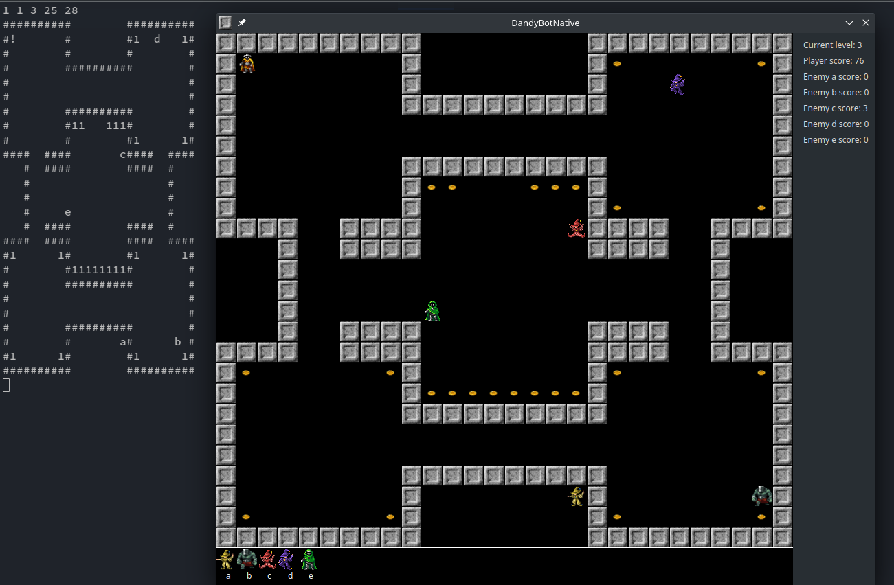

# DandyBotNative
This is a QT port of the Peter Sovietov's DandyBot
(https://github.com/true-grue/DandyBot) which was written in 2021-2022.

Ported from Python and Tkinter to the QT framework and C++ by Vad Nik
(https://github.com/vadniks/DandyBotNative) in 2023.

Sublicensed under GNU GPL v2 from MIT.

# Screenshots

# Interaction

User can interact with the game in two ways: manually press keyboard buttons
in order to move the player character or write a `C script` using the provided
header and build script inside the `sharedLib` folder and then build a shared 
library with `CMake`. This library then will be loaded at runtime by the game 
and the script will be executed on each tick.

Entry point of the shared library is the only available function in it - script(...).
It has several useful parameters such as current coordinates and objects around the player.
The function must return one of the predefined action such as move left or right.

Script debugging via TUI is also supported.

### Build

The library itself is compiled by either `GCC` or `Clang` on Linux x86_64 and is built by 
`CMake`. The whole build process can be initialized via the supplied shell script `build.sh`.
After successful execution of the build shell script both executable & shared library can 
can be found at `bin` directory. Use of the `chmod +x build.sh` command might be useful in 
order to grant execution permission to launch the script.

Script parameters and return value is described in detail in the `script.h` header file 
which can be found at `sharedLib` folder.

Programs needed to build the game & the shared library containing a script: 
`clang` or `gcc`, `cmake`, `make` and some text editor. Also, the `QT Framework` 
packages & headers must be presented in user's linux distribution.
