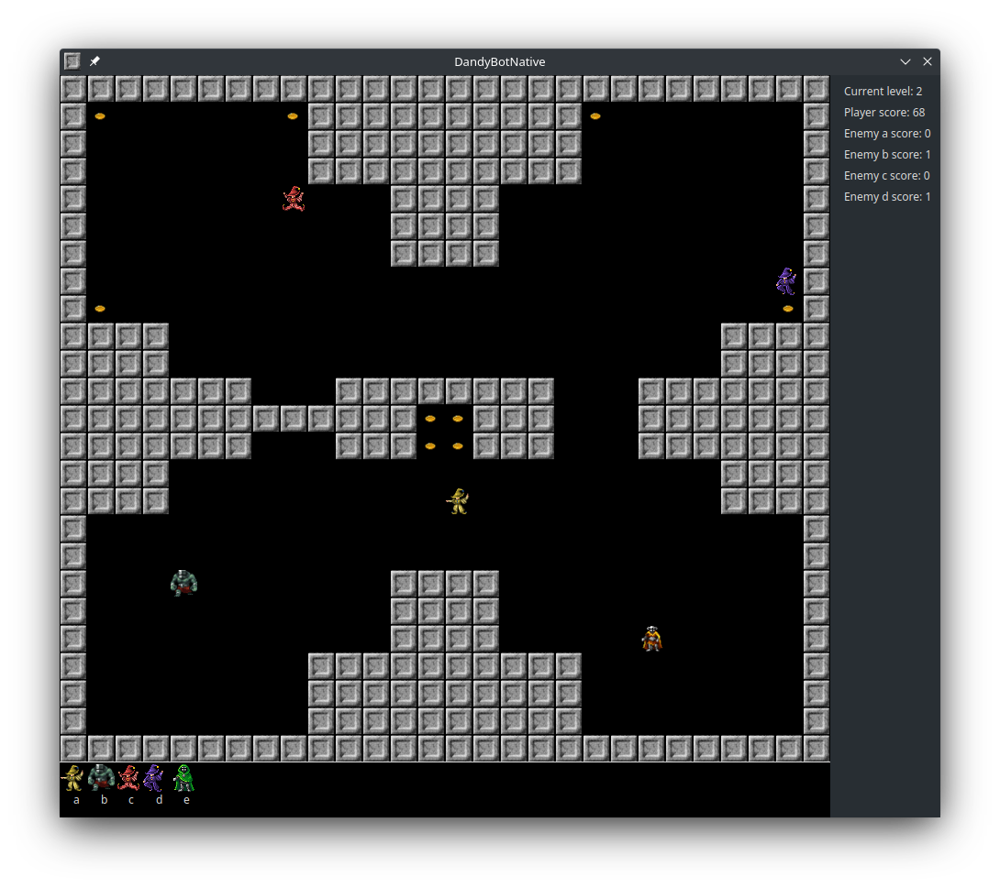

# DandyBotNative
This is a QT port of the Peter Sovietov's DandyBot
(https://github.com/true-grue/DandyBot) which was written in 2021-2022
and which I was inspired of.

Ported from Python and Tkinter to the QT framework and C++ by Vad Nik
(https://github.com/vadniks/DandyBotNative) in 2023 for educational purpose.

Sublicensed with GNU GPL v2 from MIT.

# Screenshots

# Scripting API

User can interact with the game in two ways: manually press keyboard buttons
in order to move the player character or write a `C script` using the provided
header and build script inside the `sharedLib` folder and then build a shared 
library with `CMake`. This library then will be loaded at runtime by the game 
and the script will be executed on each tick.

### Documentation

Entry point of the shared library is the only available function in it - script(...).
It has several useful parameters such as current coordinates and objects around the player.
The function must return one of the predefined action such as move left or right.

The library itself is compiled by either `GCC` or `Clang` on Linux x86_64 
(or whatever there are for Windows, MinGW or smth) and is built by `CMake`.
It uses the `CMakeLists.txt` as a build instruction. After a successful build
there will be the `libscript.so` shared library (dynamically linked library)
inside the `cmake-build-debug` folder (which must be created before initiating 
the build process by the user with `mkdir cmake-build-debug`). The library is then
connected at runtime automatically. If there's no any shared library the game will throw
an exception.

Script parameters and return value is described in detail in the `script.h` header file 
which can be found at `sharedLib` folder. Run `cmake .. && make all` command while 
being inside the `sharedLib/cmake-build-debug` folder to perform the build.

Programs needed to build the game & the shared library containing a script: 
`clang` or `gcc`, `cmake`, `make` and some text editor. Also the `QT Framework` 
packages & headers must be presented in user's linux distribution.
